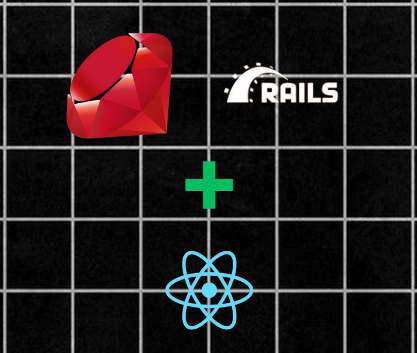
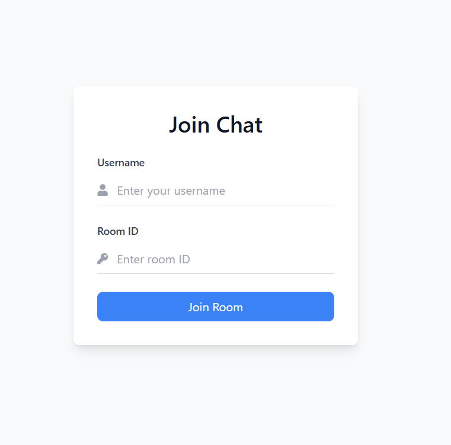
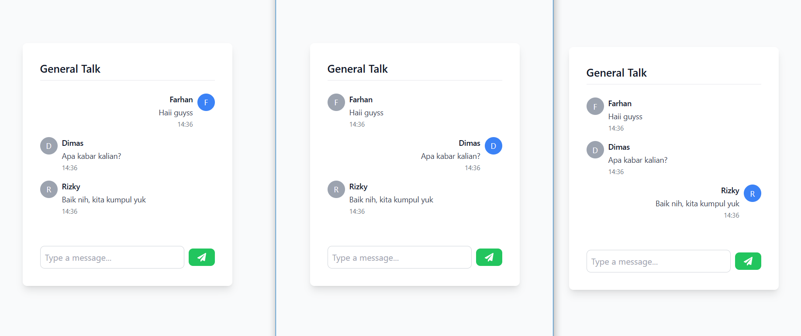

# Real-Time Chat Application (Ruby on Rails with React.js and WebSockets)



A simple real-time chat application built with React.js for the frontend, and Ruby on Rails with WebSockets (via Cable) for the backend. Users can join a room by providing a username and room ID, send messages, and see incoming messages in real-time. The chat also displays a list of users in the room.

## Features

- **Real-time Messaging:** Users can send and receive messages in real-time.
- **Join a Room:** Users can join a chat room by providing a username and room ID.
- **Message Display:** Messages are displayed in a chat window with timestamps and user identifiers.
- **User Avatar:** Displays user avatars based on the first letter of the username.

## Home Page



## Technologies Used

- **React.js:** Frontend library for building the user interface.
- **Ruby on Rails:** Backend framework for building the server and WebSocket service.
- **WebSockets (Cable):** Used for real-time communication.
- **Tailwind CSS:** Utility-first CSS framework for styling the components.
- **React Icons:** For including icons like the paper plane (send message), user, and key.

## Prerequisites

### For Backend (Ruby on Rails):

- **Ruby** (version 3.0 or higher)
- **Rails** (version 6 or higher)

### For Frontend (React.js):

- **Node.js** (version 14 or higher)
- **npm** (Node Package Manager)

## Chat Page



## Installation

### Backend (Ruby on Rails):

1. Clone this repository to your local machine:

   ```bash
   git clone https://github.com/dimasrdika/chat_app_ruby.git
   cd server
   ```

2. Install Ruby dependencies:

   ```bash
   gem install bundler
   bundle install
   ```

3. Start the Rails server:

   ```bash
   rails server
   ```

   the rails server will be running on http://localhost:3000

## Frontend (React.js):

1. Clone this repository to your local machine:

   ```bash
   git clone https://github.com/dimasrdika/chat_app_ruby.git
   cd client
   ```

2. Install dependencies:

   ```bash
   npm install
   ```

3. Start the React server:

   ```bash
   npm run dev
   ```

   the react app will be running on http://localhost:5173

# How to Use

### Join a Room:

- Enter a username and a room ID.
- Click "Join Room" to start chatting in the specified room.

### Send Messages:

- Any message sent by other users in the room will be displayed in real-time without needing to refresh the page.

---

# Project Structure

### Backend (Ruby on Rails):

- **app/** - Contains Rails application files.
  - **channels/** - Contains WebSocket channels (e.g., `chat_channel.rb`).
  - **models/** - Contains any models related to user and message data (even if not using a database).
  - **controllers/** - Contains API controllers for handling requests.
  - **config/** - Configuration files for Rails (including routes and WebSocket configurations).

### Frontend (React.js):

- **src/** - Contains the main React app files.
  - **App.js** - Main React component where the chat room is managed.
  - **service/** - Contains WebSocket service logic (e.g., `cable.js`).
  - **components/** - Contains React components for displaying the chat UI (e.g., chat messages, input forms).
- **public/** - Contains static files like `index.html`.

---

# Contribution

Feel free to fork this project and submit pull requests. Any feedback or contributions are welcome!
